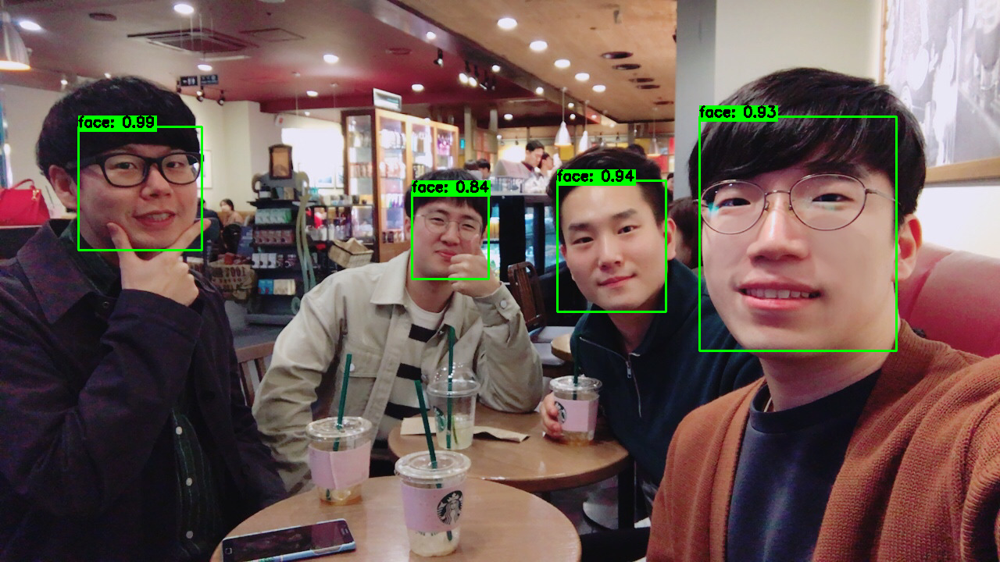

# Awesome face detection

Compare face detectors - Dlib, OpenCV, Others..
 
 

    
     
    We are neighborhood

---

 

## Processing time

Test image size : HD (720p)

We wanted to check processing time on same condition. but It couldn't becasue each method demand different input size. (ex. opencv dnn use 300x300 bgr image.)

So, Each code has a different image size.

    ocv-dnn : 300x300
    ocv-haar, dlib-hog, dlib-cnn, fr-hog, fr-cnn : VGA(640x360)
    mtcnn : HD(1280x720)
    s3fd : HD --> 1/8 scale. low resolution but awesome performance!
    insightface(retianface_r50_v1) : VGA(640x360)

Test on **Intel i7-6700K & GTX1080**.

| ocv-dnn | ocv-haar | dlib-hog | dlib-cnn | fr-hog | fr-cnn | mtcnn | S3FD | insightface |
|:---:|:---:|:---:|:---:|:---:|:---:|:---:|:---:|:---:|
| 17.79ms | 42.31ms | 108.61ms | 42.17ms | 108.50ms | 39.91ms | 334.38ms | 31.87ms | 21.49ms |

 

Test on **Intel Xeon E5-1660 & NVIDIA GV100**.

| ocv-dnn | ocv-haar | dlib-hog | dlib-cnn | fr-hog | fr-cnn | mtcnn | S3FD | insightface |
|:---:|:---:|:---:|:---:|:---:|:---:|:---:|:---:|:---:|
| 16.76ms | 32.95ms | 124.35ms | 24.58ms | 121.73ms | 24.88ms | 292.45ms | 31.07ms | TBA |

 

Test on **MacBook pro 2018 i5**.

| ocv-dnn | ocv-haar | dlib-hog | dlib-cnn | fr-hog | fr-cnn | mtcnn | S3FD | insightface |
|:---:|:---:|:---:|:---:|:---:|:---:|:---:|:---:|:---:|
| 46.53ms | 88.47ms | 174.81ms | 3276.62ms | 174.63ms | 3645.53ms | 928.75ms | 271.18ms | TBA |

 

## Requirements

- Python 3.7
- OpenCV 4.1.1 (option: build from src with highgui)
- Dlib 19.17.0
- face_recognition 1.2.3
- pytorch 1.2.0
- mxnet-cu100 1.5.1.post0

## Usage  

First, install libs

    pip install opencv-contrib-python
    pip install torch
    pip install dlib
    pip install face_recognition
    pip install easydict
    pip install mxnet-cu100
    pip install insightface

Second, prepare weight file (s3fd)
    
download s3fd weight: https://drive.google.com/open?id=1Dyr-s3mAQEj-AXCz8YIIYt6Zl3JpjFQ7
    
    [ROOT DIR]/S3FD/weights/s3fd.pth

Last, check run-time for each algorithm.

    ./run.sh

Of course, You can execute each file. and watch the result image (need opencv high gui)

    python dlib-hog.py

### Now, Select face detector you need!

 

---

## Reference

opencv haar cascade
 - https://docs.opencv.org/3.4.1/d7/d8b/tutorial_py_face_detection.html

opencv caffe based dnn (res-ssd)
 - https://github.com/opencv/opencv/tree/master/samples/dnn

dlib hog
 - http://dlib.net/

dlib cnn
 - http://blog.dlib.net/2016/10/easily-create-high-quality-object.html

face-recognition (dlib-based)
 - https://github.com/ageitgey/face_recognition

mtcnn
 - https://github.com/TropComplique/mtcnn-pytorch (code)
 - https://arxiv.org/abs/1604.02878 (paper)

s3fd
 - https://github.com/tkwoo/S3FD.pytorch (code: editing pytorch 1.3 style)
 - https://github.com/yxlijun/S3FD.pytorch (original code)

insightface(retinaface)
 - https://github.com/deepinsight/insightface (code)